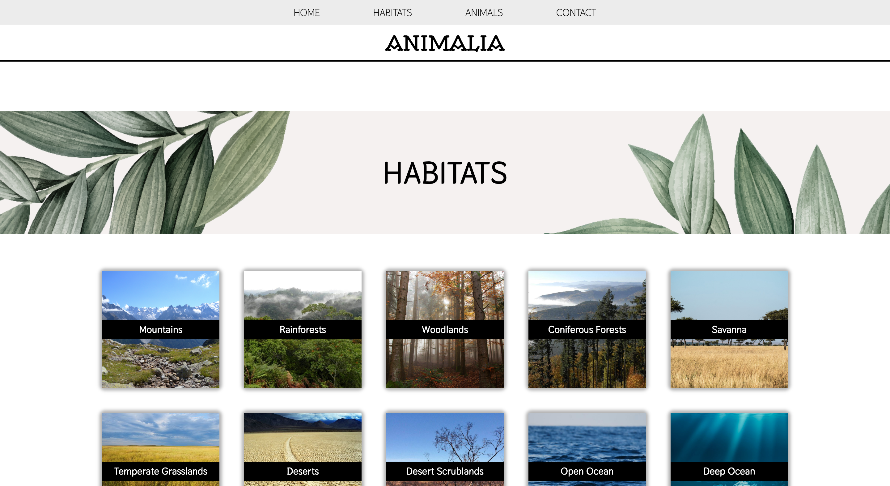
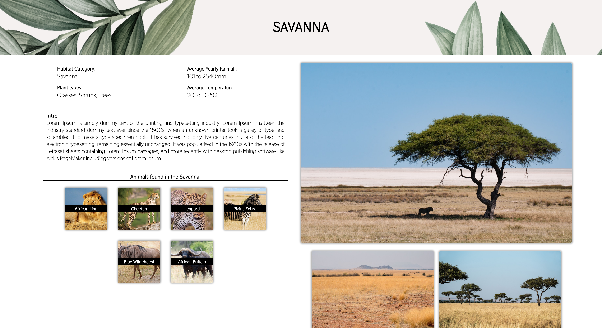
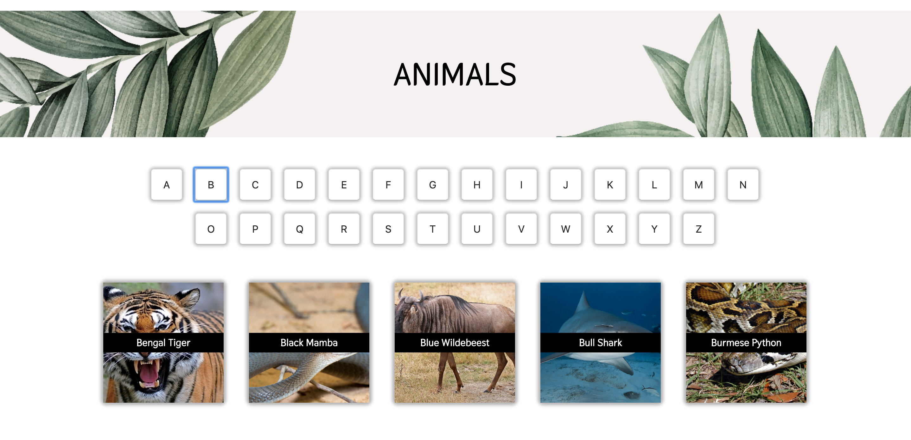
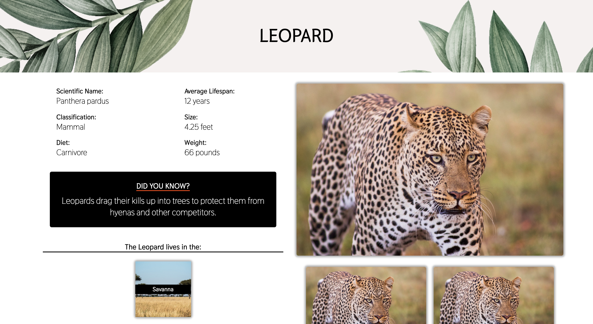
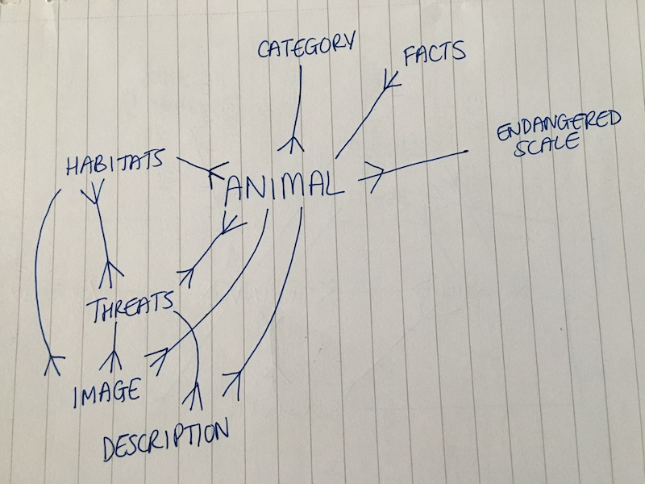
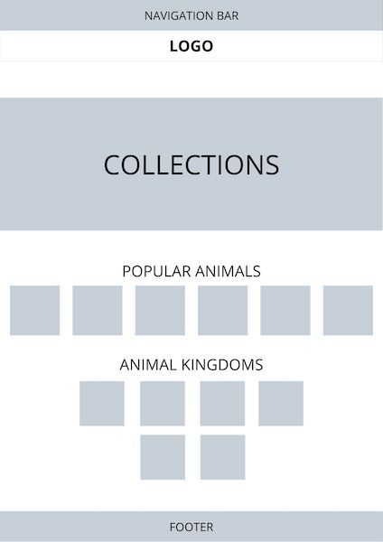
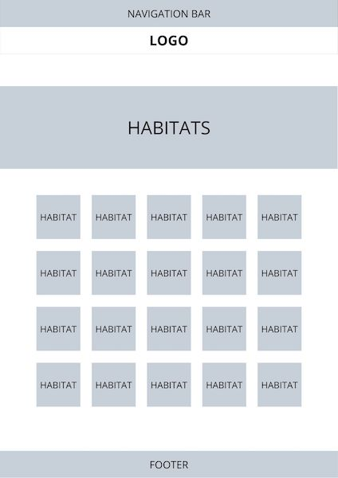
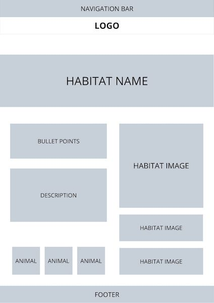
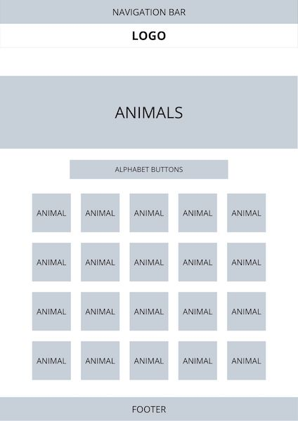
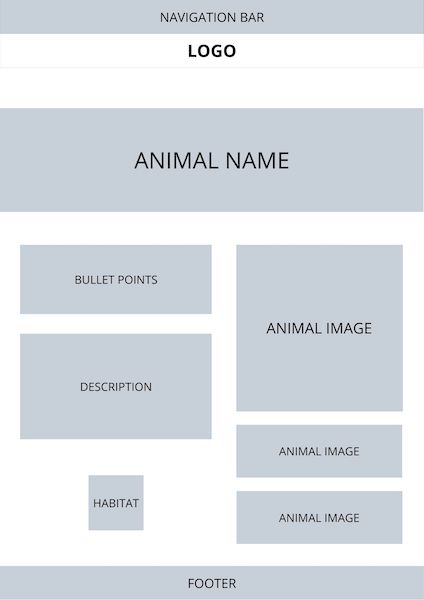

# Animalia

## Intro
Animalia is my final project created whilst studying at General Assembly in the Software Engineering Immersive. This is a full-stack application using React for the front-end, Python Django for the back-end and serving my data via a PostgreSQL database.

Duration: 1 week

#
## Motivation
For this application, I decided to create an animal encyclopedia with a focus on animal conservation. I chose this subject for my project as I have a deep interest for animals.

Many of my ideas were inspired from my project research like the [National Geographic Wild](https://www.nationalgeographic.com/animals/facts-pictures/) website, as well as the [WWF](https://www.worldwildlife.org/species) website.

#
## Table of Contents
- [Tech Used](##tech-used)
- [Deployment](##deployment)
- [Getting Started](##getting-started)
- [Architecture](##architecture)
- [Planning](##planning)
- [Challenges](##challenges)
- [Future Features](##future-features)
- [Creator](##creator)


#
## Tech used
* PostgreSQL
* Python
  * Django
* JavaScript
  * React
  * Axios
* SAAS
* HTML5


#
## Deployment
This web app is deployed on Heroku and it can be found here: HEROKU LINK


## Getting Started
Use the clone button to download the source code. In the terminal enter the following commands:

```
<!-- To install all the packages: -->
$ yarn

<!-- Create a shell: -->
$ pipenv shell

<!-- Open two terminal windows -->

<!-- In your localhost, run the front-end: -->
$ yarn serve:front

<!-- In your localhost, run the back-end: -->
$ yarn serve:back
```
Check the console for any issues and if there are check the package.json for any dependancies missing

#
## Architecture

### Animalia Homepage
This page highlights the core aspects of this website, like the newest content available or upcoming content like the Collections section. As this application is based on animals, animal classification links are present at the bottom of the home page. This is a feature I would like to continue in the future.


### Habitats
This page obtains the API data for habitats and displays it through two pages:
* Index page - displays all the habitats
* Show page - shows each habitat with relevant information, and links to the animals living in the specific habitat





I decided to connect the animals living in that specific habitat, to the Animal Show page like the animals living in the Savanna (as shown above). This is useful for the user if they'd like to know more about the animals that inhabit a habitat.


### Animals
This page obtains the API data for animals and displays it through two pages:
* Index page - displays all the animals and can be filtered via alphabet buttons, which refer to the initial of the animal name
* Show page - shows each animal with relevant information, and links to the animals's habitat





I decided to connect the animal's habitat to the Animal Show page, like Savanna for the Leopard (as shown above). This is useful for the user if they'd like to know more about the animal's habitat once they've read about the animal. A limit of 6 animals displayed has been set as there can be hundreds of species living within a specific habitat.

### Database
A large aspect of this application is the creation of all the data, instead of using an external API. Within the timespan, I was only able to seed 14 habitats and 25+ animals. There are many models used in the backend, however the relationships between my models are quite complex as they all interconnect with each other in some way.

#
## Planning
### Back-end
The complexity of my project lies in the many entwined relationships created. I made a Entity Relationship Diagram(ERD) to show the one-to-many and many-to-many relationships between all my models, to simplify the contents of the serializers:



### Front-end
Some hand-drawn wireframes were made to highlight the user experience of my application:

Home Page



Habitat Pages




Animal Pages





#
## Challenges
This was my first time working with Django and it was quite a learning curve for me as a lot of the functionality is covered by Django. As I started to understand the relationships between the models, the serializers, the views and the urls, Django became more and more simpler to use as I created my application. Also, this is my first project in which I have used Python as a key programming language and I really enjoyed the challenge of coding in a new language after using JavaScript in my previous projects and throughout my studying at General Assembly.

One of the key challenges I faced was creating the 'animal' model as it contained many fields, some which were connected via one-to-many and many-to-many relationships. Keeping my code clean really helped with this, as well as commenting clearly what the model was.

```
# ANIMAL MODEL
class Animal(models.Model):
    name = models.CharField(max_length=50, unique=True)
    scientific_name = models.CharField(max_length=100, unique=True)
    average_lifespan = models.IntegerField()
    size = models.FloatField()
    size_unit = models.CharField(max_length=30, default='')
    weight = models.FloatField()
    weight_unit = models.CharField(max_length=30, default='')
    fact = models.CharField(max_length=300, blank=True)

    diet_choices = (
      ('HE', 'Herbivore'),
      ('OM', 'Omnivore'),
      ('CA', 'Carnivore')
    )
    diet = models.CharField(max_length=20, choices=diet_choices)

    classification = models.ForeignKey(
      Classification,
      related_name='animals',
      on_delete=models.DO_NOTHING,
      null=True
    )
    habitats = models.ForeignKey(
      Habitat,
      related_name='animals',
      on_delete=models.DO_NOTHING,
      null=True
    )
    threats = models.ManyToManyField(
      Threat,
      related_name='animals',
      blank=True
    )

    def __str__(self):
        return f'{self.name}'
```

An additional challenge I faced was filtering my Animal Index page to show the animals who's name initial matched the letter chosen by the user. Breaking the problem down writing the steps out and by pseudo-coding helped a lot.

```
// create alphabet array
  populateAlphabet() {
    for ( let i = 65; i < 91; i++) {
      const letter = String.fromCharCode(i)
      this.alphabet.push(letter)
    }
  }

  componentDidMount() {
    this.populateAlphabet()
    axios.get('/api/animals')
      .then(res => this.setState({ animals: res.data }))
      .catch(err => console.log(err))
  }

  handleClick(e){
    this.setState({ chosenLetter: e.target.value })
  }

  // filter animals according to the letter clicked
  filteredAnimals() {
    const { animals, chosenLetter } = this.state
    const sortedArray = [...animals]
    sortedArray.sort((a, b) => (a.name > b.name) ? 1 : -1)
    console.log(sortedArray)
    return sortedArray.filter(animal => {
      if (animal.name.charAt(0) === chosenLetter || chosenLetter === '')
        return animal
    })
  }
```

#
## Future Features
In the future, I hope to add the additional models in my back-end like collections and the Red List scale for endangered animals as well as creating web pages for these models. I'd also like to add additional components on React for my models like classifications, as well as connecting all webpages together.

An additional feature I'd like to create is a random generator function for the Habitat Show page for displaying animals that live within in a specific habitat. As a user, seeing a random selection of animals that live within a habitat makes the content more interesting. A user could stumble upon an animal in a habitat they were not aware of.


#
## Developer
Reema Patel
